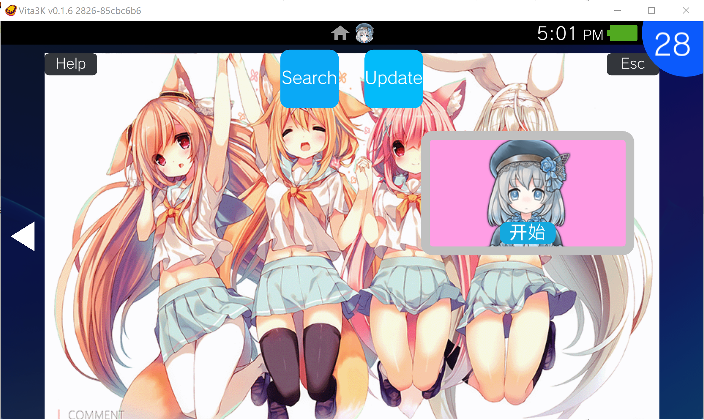
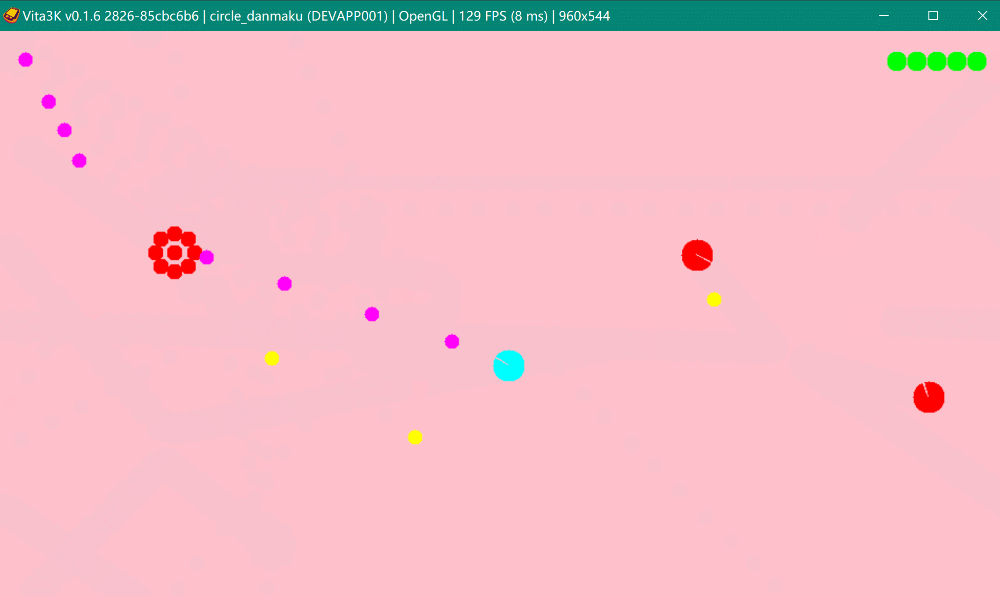
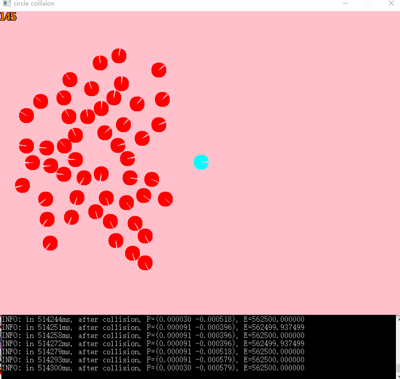
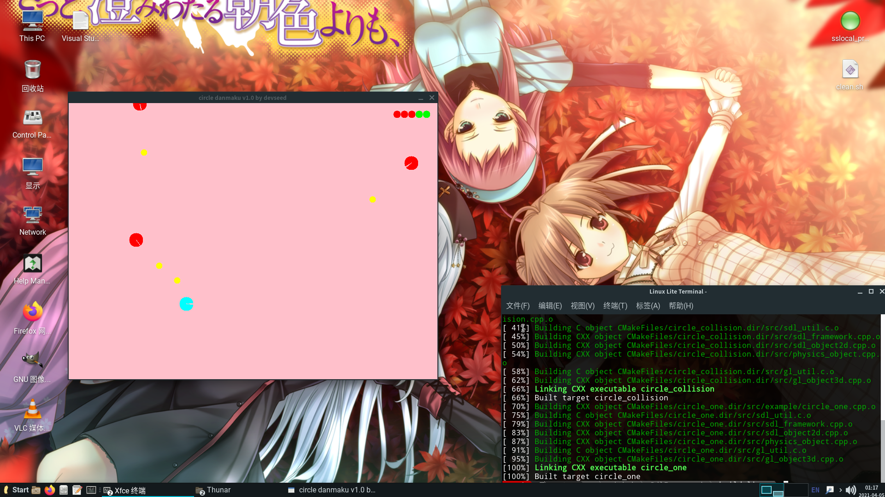
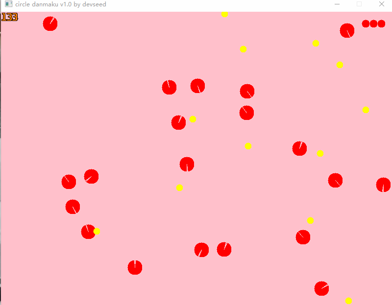
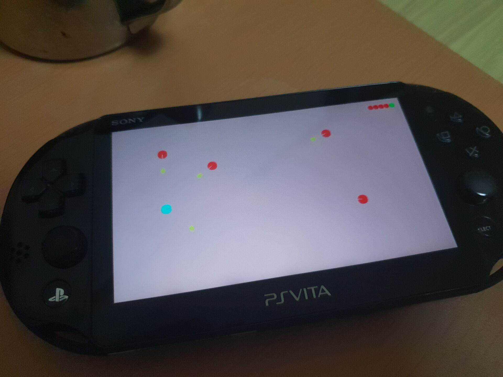
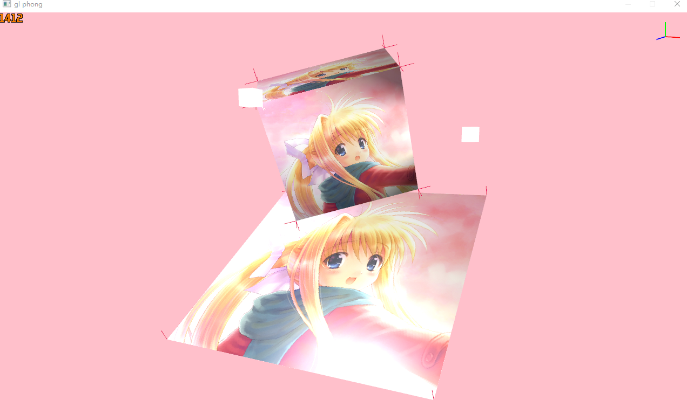
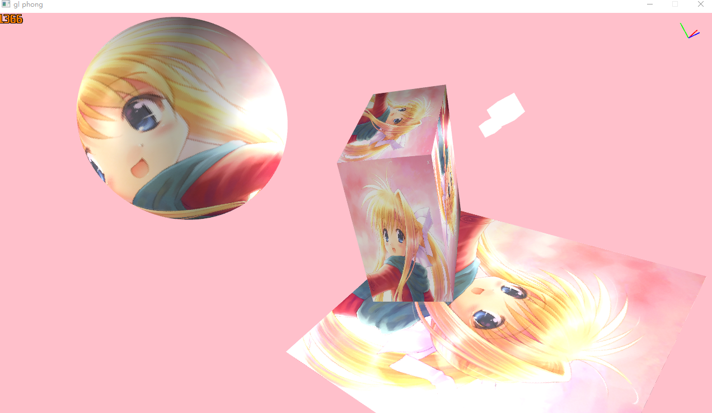
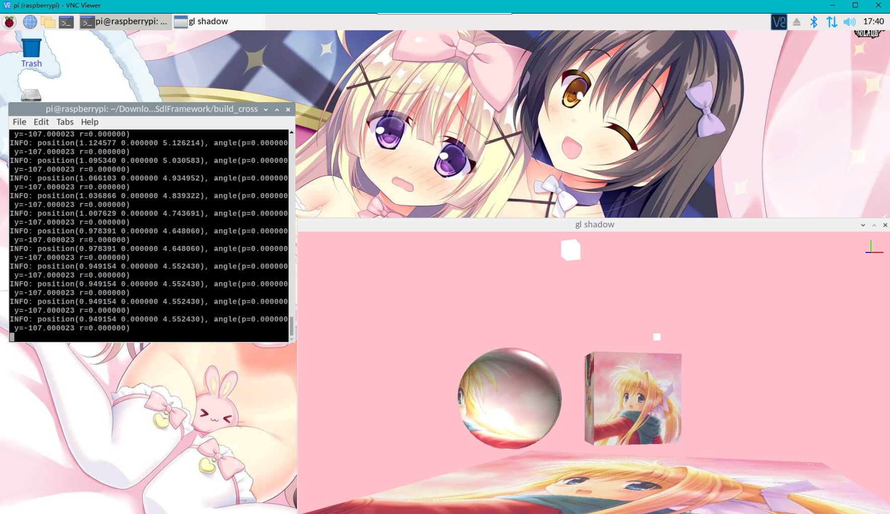

# SdlFramework

A simple experiment game engine by `SDL` and `OpenGL`.  
Tested by multi enviroment : `msvc`, `clang`, `mingw`, `linux (including raspberrypi)`, `psvita` and even `web(emcc)`.

Online game demo: [circle_danmaku](https://blog.schnee.moe/static/circle_danmaku.html), [gl_phong_demo](https://blog.schnee.moe/static/gl_phong_demo.html)





## 1. Structures

### (1) SDL  part

Currently the class is as below:

**sdl_framework.hpp**
`CAppSDL`:  create window and renderer, contain the global information

`CStageManagerSDL`: manage the game stage, a stage can be a level or menu,  define how to change stage here

`CStageSDL`:  a stage contains many scenes in a level and handles the event if change scene.

`CSceneSDL`: a scene contains many objects and determine how objects interact with each other

**sdl_object2d.hpp**
`CObject2DSDL`: a object used for SDL rendering

`CSingleTextureSDL`:  a object with a texture

`CCircleSDL`: simple circle in SDL, for static drawing

### (2) OpenGL part

**gl_scene.hpp**  
`Light`: the light information for rendering lighting

`MaterialPhong`: material structure for object with phong rendering

`Vertex`:  defines the structure of vertex attribution

`Camera`: a camera structure with position and Euler angles， as well as the perspective information

`CSceneGL`:  a scene  contains layers or objects for rendering

**gl_layers.hpp**  
`CLayerGL`:  the layer for rendering, for using different shaders or defered rendering

`CLayerShadowGL(not finished)`:  generate the shadow map by every light, point light, direction light

`CLayerEnviromentGL(not finished)`:  Dynamic Environment Mapping: viewing to each direction (without shadow)

`CLayerHudGL`: show the small window for debug information as HUD

`CLayerHudAttitude`:  render a small window for viewing the attitude(posture) of the camera

`CLayerLightGL`:  generate a cube in the light position for viewing light

**gl_assets.hpp**  
`CShaderGL`: a class of shader manager, for loading shaders, compile, link and use program for rendering

`CTextureGL|2DGL|3DGL|CubeGL(not finished)`:  a class of texture manager, for filling texture of reading from texture

**gl_object3d.hpp**  
`CMeshGL`: contains vao, vbo, ebo, textures and shaders for each layer

`CObject3DGL`:  a 3D object for gl rendering, manage multi meshes

`CPlaneMeshGL`: a rectangle unit plane in XOY

`CCubeMeshGL`:a unit cube in the center

`CSphereMeshGL`: A unit sphere by a certain latitude and longitude step

### (3) Physical part

**physics_object.hpp**  
`CPhsicalObject`: This object contains physical information, used for physical engine

## 2. Build

I use cmake to build the demo. Integrated graphic card might have some problems with Opengl ES. See them in /script in detail.  

### (1) local msvc

 You need either download each libraries below, or download all the requirement in [externlib](https://github.com/YuriSizuku/SdlFramework/releases/download/v0.1/externlib.7z).

[glew-2.1.0](https://sourceforge.net/projects/glew/files/glew/2.1.0/),  download the glew binary library

[glm-0.9.9](https://github.com/g-truc/glm/releases/download/0.9.9.8/glm-0.9.9.8.7z),  download and rename `glm` to `glm-0.9.9`

[SDL-2.0.14](https://www.libsdl.org/release/SDL2-devel-2.0.14-VC.zip)  download the SDL develop binary library

[stb](https://github.com/nothings/stb/archive/refs/heads/master.zip) download and rename  `stb-master` to`stb`

create `./externlib` folder and put the libraries in here , see  `CMakeLists.txt` in detail.
**a. For Visual studio sln project**

```cmd
mkdir build_win32
cd build_win32
cmake .. -G "Visual Studio 14 2015" -A win32
cd ..
mkdir build_win64
cd build_x64
cmake .. -G "Visual Studio 14 2015" -A x64
```

**b. For vscode, with clang and ninjia**  
If you are using clang, using lower version cmake might only recogonize `clang-cl` for linking MSVC lib.
Install `CMake`, `CMake Tools` extensions at first, then config `.\.vscode\settings.json`, win32 for example

```json
"cmake.configureArgs" : [
    "-DWIN64=OFF",
    "-DCMAKE_C_FLAGS=-m32",
    "-DCMAKE_CXX_FLAGS=-m32",
], 
```

Then press `ctrl+shift+p`, then  `CMake: Select a Kit`, `CMake: Configure`, `CMake: Build`, `CMake: Install`

### (2) local mingw

install msys2 in windows or mingw in linux (see next part),

```sh
pacman -Syu --noconfirm
pacman -S --noconfirm mingw-w64-x86_64-binutils mingw-w64-x86_64-gcc mingw-w64-x86_64-gdb # mingw64 compile tool
pacman -S --noconfirm mingw-w64-i686-binutils mingw-w64-i686-gcc mingw-w64-i686-gdb # mingw32 compile tool
pacman -S --noconfirm make # util tools
pacman -S --noconfirm mingw-w64-i686-SDL2 mingw-w64-x86_64-SDL2
pacman -S --noconfirm mingw-w64-i686-glew mingw-w64-x86_64-glew
pacman -S --noconfirm mingw-w64-i686-glm mingw-w64-x86_64-glm
pacman -S --noconfirm mingw-w64-i686-mesa mingw-w64-x86_64-mesa
```

Use `local_mingw32.sh` or `local_mingw64.sh` to build.

### (3) local linux

Install the requirement and then generate Makefile.

```sh
sudo apt-get install gcc gdb make cmake git
sudo apt-get install libsdl2-dev libgl1-mesa-dev libglew-dev libglm-dev
```

If you want to build for x86 in a x64 linux, install these after you install the x64 libray.  

```sh
sudo dpkg --add-architecture i386 
sudo apt-get install gcc-multilib g++multilib 
sudo apt-get install libsdl2-dev:i386 libgl1-mesa-dev:i386 libglew-dev:i386
```

Use `local_linux32.sh` or `local_linux64.sh` to build.

In  vmware,  if have any problems, try to use `SDL_GL_CONTEXT_PROFILE_CORE`, with the version 3.3,  and these environment

```sh
export SDL_VIDEO_X11_VISUALID=
export MESA_GL_VERSION_OVERRIDE=3.3
```

### (4) cross raspberrypi

Install [arm-linux-gnueabihf-gcc](https://gnutoolchains.com/raspberry/) cross compile tool at first.  
Then you can use `samba`, or read the tf card from card reader.  

If using `samba`, the config in `/etc/smaba/smb.conf` is as below to allow visit symbol link.  

```conf
[global]
    follow symlinks = yes 
    unix extensions = no
    wide links = yes  
    min protocol = NT1 
    aio read size = 0 # improve writing speed

[chroot] 
    comment = the root dir for raspberripi
    path = /
    follow symlinks = yes
    wide links = yes
    guest ok = no
    browseable = yes
```

Using the cmd as below to cross build arm32 elf
  
``` bat
@echo off
:: your raspberrypi root dir
set SYSROOT=//raspberrypi/chroot

mkdir %~dp0%\build_cross
cd %~dp0%\build_cross

cmake .. -G "Unix Makefiles" -DCMAKE_C_COMPILER_FORCED=ON -DCMAKE_CXX_COMPILER_FORCED=ON -DCMAKE_SYSTEM_NAME=Linux -DCMAKE_C_COMPILER=arm-linux-gnueabihf-gcc -DCMAKE_CXX_COMPILER=arm-linux-gnueabihf-g++ -DCMAKE_C_FLAGS="--sysroot=%SYSROOT%" -DCMAKE_CXX_FLAGS="--sysroot=%SYSROOT%" -DCMAKE_EXE_LINKER_FLAGS="-Wl,-rpath=//usr/lib/arm-linux-gnueabihf/:/opt/vc/lib/"

make all
make install
cd ..
```

As for running in raspberry pi, see `3. (4) gl shadow test` in detail.  

### (5) cross psv

Install [vitasdk](https://github.com/vitasdk/vdpm) and then use `cross_psv.sh` to compile. You can also use these commands for uploading vpk to psv.

```sh
mkdir build_psv && cd build_psv
export VITASDK=/d/AppExtend/SDK/psvsdk
export PATH=$VITASDK/bin:$PATH
cmake .. -G "Unix Makefiles" -DCMAKE_TOOLCHAIN_FILE="$VITASDK/share/vita.toolchain.cmake"
make circle_danmaku.vpk
curl -T circle_danmaku.vpk ftp://10.2.12.5:1337/ux0:/temp/
```

### (6) cross web
Install [emsdk](https://github.com/emscripten-core/emsdk) and then use `cross_web.sh` to build.
　　
## 3. Demos/Games

### (1) circle collision

A simulator for Perfect Elastic Collision, by conservation of momentum and energy.

Download the release demo [circle_collision](https://github.com/YuriSizuku/SdlFramework/releases/download/v0.1/circle_collision.exe)



### (2) circle Danmaku

A Danmaku game whose object is all circle.

The goal in this game is to survive more than 5 minutes, and defeat the enemy as much as possible.

Download the release demo [circle_danmaku](https://github.com/YuriSizuku/SdlFramework/releases/download/v0.1/circle_danmaku.exe)

Press `R` to restart. `WASD` to move, `Space` fire bullet, `JK` rotate







### (3) gl phong test

This is a example about rendering the objects by phong method. In this example, there are 3 lights,  1 point light(front white cube), 1 spot light(left white cube), 1 directional light. After rendering the object,  we render the axis on the right to see the attitude of the camera, and every point normal by the geometry shader.

We can explore this scene like a flying game. Press  `wasd` to move the position, `qe` to go up and down,  `uo` to rotate roll, `jl` to rotate the yaw, `ik` to rotate the pitch.





### (4) gl shadow test  

The test of gl_shadow, also it can run in raspberrypi.  
As for opengl support in raspberry pi, `raspi-config` to set GL2 for desktop to support glew. Then run command `MESA_GL_VERSION_OVERRIDE=3.3 ./gl_shadow_test` to show the demo.  

In xserver wersion,  you can use `VcxSrv` in windows, and without native opengl render config. If there is an error with GLU, try  `export SDL_VIDEO_X11_VISUALID=` and then run `MESA_GL_VERSION_OVERRIDE=3.3 ./gl_shadow_test`.  




